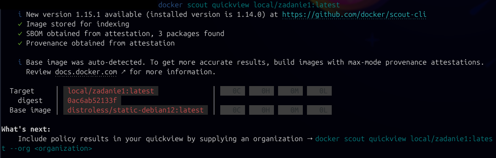

# Analiza obrazu:
---

* budowanie: `docker buildx build --load -t local/zadanie1:latest --builder server-builder --platform linux/arm64,linux/amd64 --sbom=true --provenance=mode=max -f Dockerfile .`

* sprawdzenie: `docker scout quickview local/zadanie1:latest`

