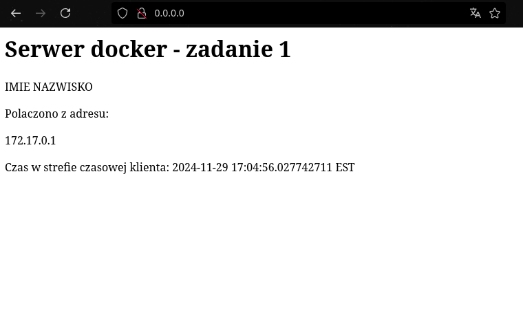

# Instrukcja uruchomienia
---

* utworzyć builder `docker buildx create --driver docker-container --name server-builder --bootstrap`
* zbudować obraz `docker buildx build --load -t local/zadanie1:latest --builder server-builder --platform linux/arm64,linux/amd64 -f Dockerfile .`
* sprawdzić liczbę warstw `docker image history local/zadanie1:latest | awk 'NR > 1' | wc -l`
* uruchomić kontener `docker run --rm -it --name zadanie1_cont -p 80:80 -v /usr/share/zoneinfo:/usr/share/zoneinfo:ro -v ./log:/srv_log local/zadanie1:latest` (wymaga zmiany pliku Dockerfile jeżeli w systemie nie znajduje się ścieżka `/usr/share/zoneinfo`)
* sprawdzić logi `cat log/log.txt`
* zatrzymać kontener `docker stop zadanie1_cont &`

