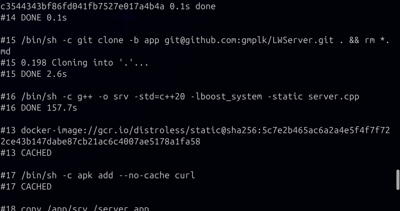

# Instrukcja uruchomienia [wersja git]
---

W celu klonowania kodu źródłowego z platformy github konieczne jest dodanie znanego klucza publicznego do agenta:
```
eval $(ssh-agent)
```

```
ssh-add ~/.ssh/[klucz]
```

Wtedy można:

* utworzyć builder `docker buildx create --driver docker-container --name server-builder --bootstrap`
* zbudować obraz `docker buildx build --load -t local/zadanie1:latest --builder server-builder --platform linux/arm64,linux/amd64 -f Dockerfile_git --progress=plain --ssh=default=$SSH_AUTH_SOCK .`
* sprawdzić liczbę warstw `docker image history local/zadanie1:latest | awk 'NR > 1' | wc -l`
* uruchomić kontener `docker run --rm -it --name zadanie1_cont -p 80:80 -v /usr/share/zoneinfo:/usr/share/zoneinfo:ro -v ./log:/srv_log local/zadanie1:latest`
* sprawdzić logi `cat log/log.txt`
* zatrzymać kontener `docker stop zadanie1_cont &`

