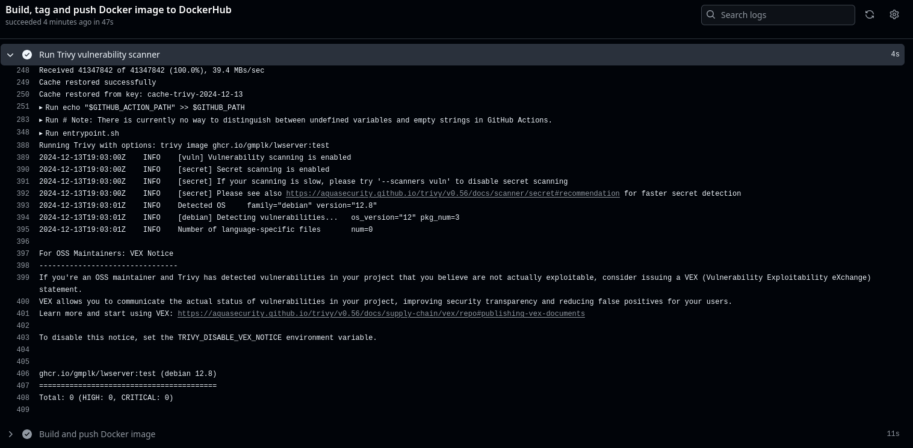

# Zadanie 2 - część dodatkowa

---

Kod realizujący github actions: [trivy_action.yml](.github/workflows/trivy_action.yml)

Opis kroków:
- checkout
- metadane
- QEMU (dodatkowe architektury budowania obrazu)
- Buildx (narzędzie budowania)
- Logowanie do usługi Github (wymagane do nadpisania obrazu w rejestrze ghcr.io)
- Budowanie testowe
- Sprawdzenie obrazu za pomocą usługi Trivy
- Budowanie wraz z umieszczeniem obrazu na prywatnym i publicznym repozytorium

Efekt działania gha ([wykonanie](https://github.com/gmplk/LWServer/actions/runs/12321481333)):

